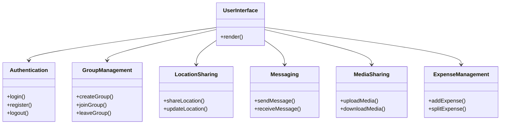
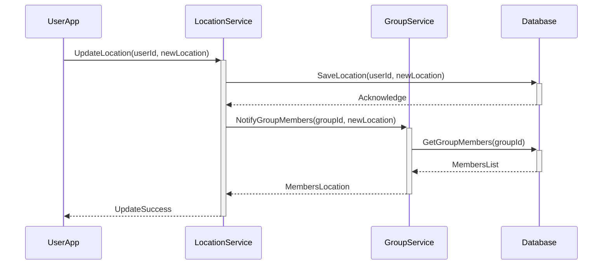
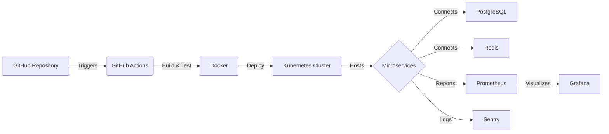

# NomadCrew Project Documentation

## Introduction

Welcome to the NomadCrew project! This document provides a comprehensive overview of the system architecture, components, and workflows for the NomadCrew app – a platform for creating disposable groups for trips with live location sharing, messaging, media sharing, and expense splitting.

## System Architecture Overview

NomadCrew utilizes a microservices architecture to ensure scalability and maintainability. The frontend is developed with Svelte Native for a seamless cross-platform user experience. The backend, powered by Go, is composed of several microservices that handle different aspects of the app such as user management, group handling, and live location updates. Communication between services is facilitated through gRPC for efficiency and performance. The app leverages PostgreSQL for relational data storage and ...

## Frontend - Svelte Native

### Key Features

- User authentication
- Group management
- Live location sharing
- In-app messaging
- Media sharing
- Expense splitting

### Component Diagram

## Backend - Go with gRPC

### Services

- User Service
- Group Service
- Location Service
- Messaging Service
- Media Service
- Expense Service

### Sequence Diagram for Location Update

## Database - PostgreSQL and Redis

### Schema Design

#### Users

- UserID (Primary Key)
- Username
- Email
- PasswordHash
- ProfilePictureURL
- CreatedAt
- UpdatedAt

#### Groups

- GroupID (Primary Key)
- GroupName
- Description
- CreatedAt
- UpdatedAt

#### GroupMembers

- GroupID (Foreign Key)
- UserID (Foreign Key)
- MemberRole (e.g., Admin, Member)
- JoinedAt
- Composite Primary Key: (GroupID, UserID)

#### Locations

- LocationID (Primary Key)
- UserID (Foreign Key)
- Latitude
- Longitude
- Timestamp

#### Messages

- MessageID (Primary Key)
- GroupID (Foreign Key)
- SenderID (Foreign Key)
- Content
- CreatedAt

#### Media

- MediaID (Primary Key)
- GroupID (Foreign Key)
- UploaderID (Foreign Key)
- MediaURL
- MediaType (e.g., Image, Video)
- CreatedAt

#### Expenses

- ExpenseID (Primary Key)
- GroupID (Foreign Key)
- PaidByUserID (Foreign Key)
- Amount
- Description
- CreatedAt

#### ExpenseContributions

- ExpenseID (Foreign Key)
- ContributorUserID (Foreign Key)
- ContributionAmount
- Composite Primary Key: (ExpenseID, ContributorUserID)

## Infrastructure and DevOps

- Docker and Kubernetes for containerization and orchestration
- GitHub Actions for CI/CD
- Prometheus, Grafana, and Sentry for monitoring

### Infrastructure Diagram

## Contribution Guidelines

Contributors are welcome to join the NomadCrew project! Here are some guidelines to ensure a smooth collaboration:

- **Coding Standards:** Follow best practices for Svelte Native and Go.
- **Pull Requests:** All PRs should be accompanied by a clear description of changes. Code reviews are mandatory before merging.
- **Testing:** New features should include unit and integration tests.
- **Issue Tracking:** Use GitHub issues to track bugs and feature requests. Be detailed in your reports.
- **Code of Conduct:** Respect all contributors, be open to feedback, and conduct yourself professionally. No tolerance for harassment or abusive behavior.

## Project Roadmap

- **Phase 1:** Initial setup, basic user authentication, and group creation functionality.
- **Phase 2:** Implement live location sharing and basic messaging features.
- **Phase 3:** Add media sharing and expense splitting features.
- **Phase 4:** Focus on testing, feedback collection, and refining features for the first official release. Plan for post-release updates and feature additions.

## Contact and Support

For more information or support, please reach out to [your email/contact information]. You can also join our Slack workspace [link to Slack workspace] to be a part of the NomadCrew community.
